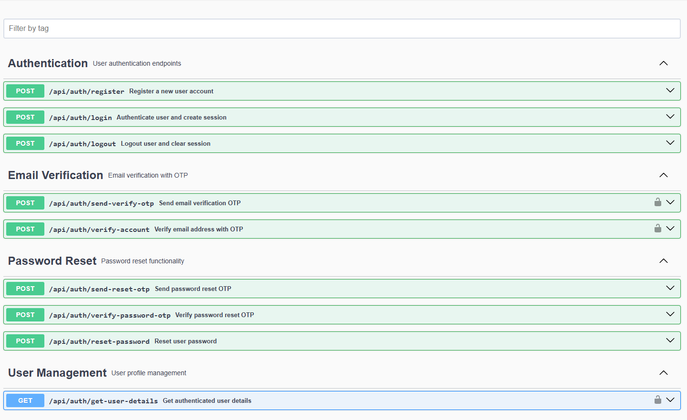
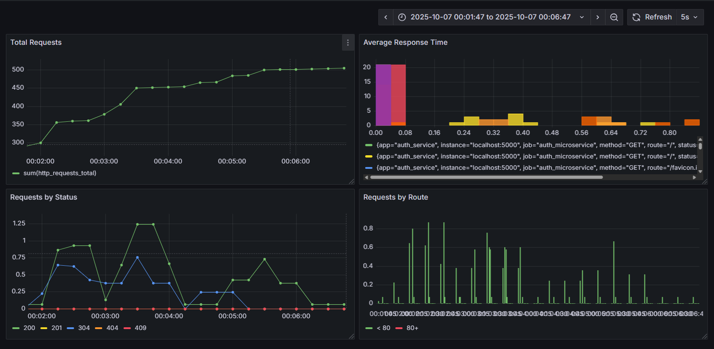
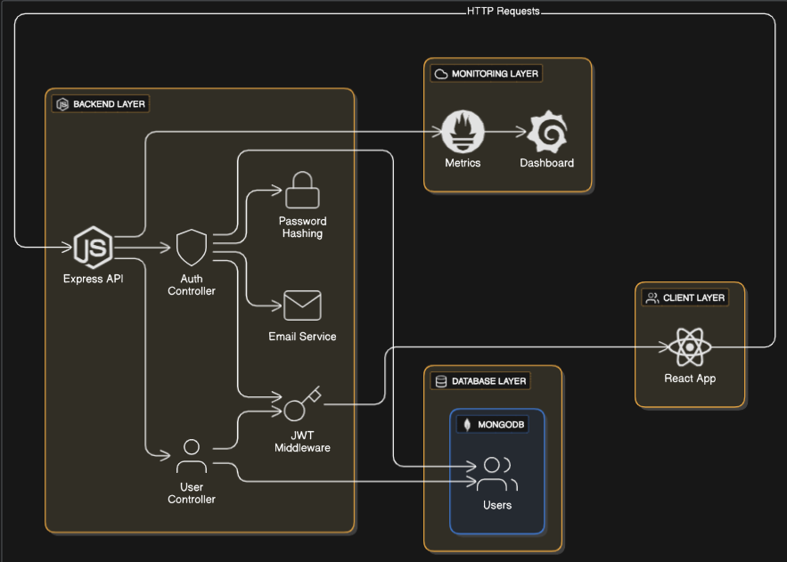

# MERN Authentication Microservice

<div align="center">

<table>
	<tr>
		<td></td>
		<td>
			<h1>MERN Auth Microservice</h1>
			<em>Secure, Scalable, Production-Ready Authentication API</em>
		</td>
	</tr>
</table>

**A robust authentication microservice for modern web applications, featuring JWT, email verification, password reset, and monitoring.**

[](https://nodejs.org/)
[](https://expressjs.com/)
[](https://mongodb.com/)
[](https://jwt.io/)
[](https://www.docker.com/)
[](https://prometheus.io/)
[](https://grafana.com/)
[](https://swagger.io/)

[Features](#-features) • [Tech Stack](#-tech-stack) • [Getting Started](#-getting-started) • [Architecture](#-architecture) • [Contributing](#-contributing)

</div>

---

## 📋 Overview

**MERN Auth Microservice** is a production-ready authentication backend for web and mobile apps. It provides secure user registration, login, JWT-based sessions, email verification, password reset, and exposes metrics for monitoring. Built with Node.js, Express, and MongoDB, it is containerized for easy deployment and comes with Swagger API docs.

---

## 📸 Screenshots

<table width="100%">
	<tr>
		<td align="center" colspan="3">
			<br/>
			<b>API Documentation</b><br/>
			<sub>Interactive Swagger UI for all endpoints</sub>
		</td>
	</tr>
	<tr>
  <td align="center" width="50%">
    <br/>
    <b>Prometheus & Grafana Dashboards</b><br/>
    <sub>Real-time monitoring endpoint</sub>
  </td>
  <td align="center" width="50%">
    <br/>
    <b>Authentication Flow</b><br/>
    <sub>JWT, Email Verification, Password Reset, Monitoring</sub>
  </td>
</tr>
</table>

---

## 🌟 Features

### Authentication
- **JWT-based Login** — Secure, stateless sessions
- **User Registration** — With hashed passwords
- **Email Verification** — OTP-based, with expiry
- **Password Reset** — Multi-step, OTP-protected
- **Logout** — Secure session termination

### Security
- **HTTP-only Cookies** — Prevent XSS attacks
- **Bcrypt Password Hashing** — 10 salt rounds
- **Environment-based Cookie Security** — SameSite, Secure flags
- **Input Validation** — Required fields, email normalization

### Monitoring & Observability
- **Prometheus Metrics** — System and custom HTTP request metrics
- **Grafana Ready** — For dashboard visualization

### Developer Experience
- **Swagger UI** — Interactive API documentation
- **Dockerized** — Easy deployment anywhere
- **Modular Codebase** — Clean separation of concerns

---

## 🎯 Use Cases

- **User Authentication Service** for any web/mobile app
- **Microservice in a larger architecture**
- **API Gateway Auth Layer**
- **Production-ready Auth for SaaS**
- **Learning/Reference for secure Node.js auth**

---

## 🛠 Tech Stack

### Backend
| Technology      | Purpose                                 |
|-----------------|-----------------------------------------|
| Express.js      | Backend Framework                       |
| MongoDB         | NoSQL database                          |
| Mongoose        | MongoDB ODM                             |
| JWT             | Token-based authentication              |
| bcryptjs        | Password hashing                        |
| Nodemailer      | Email sending (SMTP)                    |
| prom-client     | Prometheus metrics                      |
| swagger-jsdoc   | API documentation generation            |

### DevOps
| Technology      | Purpose                                 |
|-----------------|-----------------------------------------|
| Docker          | Containerization                        |
| Prometheus      | Monitoring                              |
| Grafana         | Metrics visualization                   |

---

## 🏗 Architecture

```
┌──────────────────────────────────────────────┐
│                Client (Frontend)             │
│      (Any web/mobile app, Postman, etc.)     │
└──────────────────────────────────────────────┘
								│      HTTPS/REST
								▼
┌──────────────────────────────────────────────┐
│        MERN Auth Microservice (Node.js)      │
│ ┌──────────────┐  ┌──────────────┐           │
│ │  Express.js  │  │  Prometheus  │           │
│ │  API Server  │  │  Metrics     │           │
│ └──────────────┘  └──────────────┘           │
│        │                │                    │
│        ▼                ▼                    │
│   MongoDB Atlas   /metrics endpoint          │
└──────────────────────────────────────────────┘
```

---

## 🚀 Getting Started

### Prerequisites

- **Node.js** (v18 or higher)
- **npm**
- **MongoDB** (local or Atlas)

### Installation

1. **Clone the repository**
	 ```bash
	 git clone https://github.com/karanhimadri/mern-authentication-microservice.git
	 cd mern-authentication-microservice/server
	 ```

2. **Install dependencies**
	 ```bash
	 npm install
	 ```

3. **Configure environment variables**
	 - Copy `.env.example` to `.env` and fill in your values:
		 ```env
		 MONGO_URI=your_mongodb_connection_string
		 JWT_SECRET=your_jwt_secret
		 SMTP_USER=your_smtp_user
		 SMTP_PASS=your_smtp_pass
		 SENDER_EMAIL=your_email@example.com
		 NODE_ENV=development
		 PORT=4000
		 ```

### Running the Application

```bash
npm start
# Server runs on http://localhost:4000
```

### Docker

```bash
docker build -t mern-auth-microservice .
docker run -p 8080:4000 --env-file .env mern-auth-microservice
# App will be available at http://localhost:8080
```

---

## 👨‍💻 Developer Profile

**Himadri Karan**  
*Backend Developer & Business Solutions Specialist*

- 📧 **Email**: [Karanhimadri1234@gmail.com](mailto:Karanhimadri1234@gmail.com)
- 💼 **LinkedIn**: [linkedin.com/in/himadrikaran](https://linkedin.com/in/himadrikaran)
- 🌐 **Portfolio**: [Himadri.me](https://himadri.me/)
- 🐙 **GitHub**: [github.com/karanhimadri](https://github.com/karanhimadri)

---

<div align="center">

**Made with ❤️ and lots of ☕**

If you found this project helpful, please give it a ⭐️!

</div>
