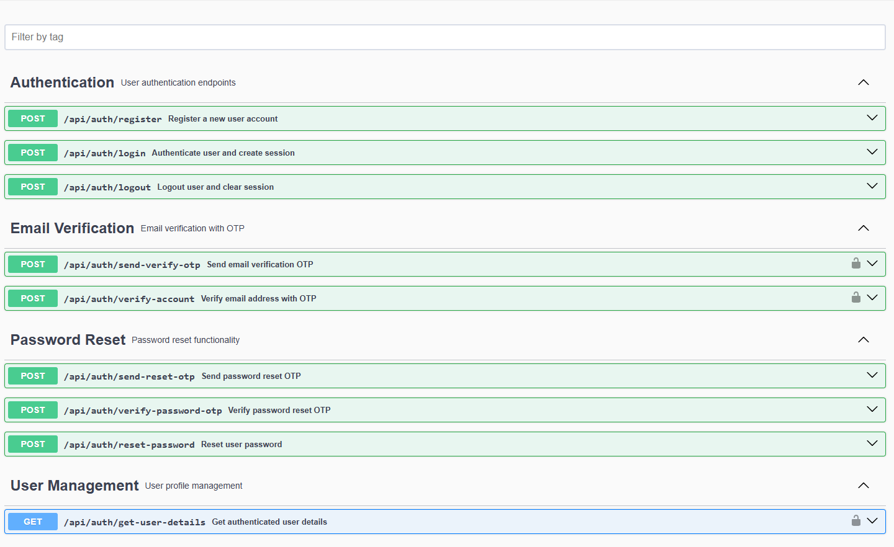
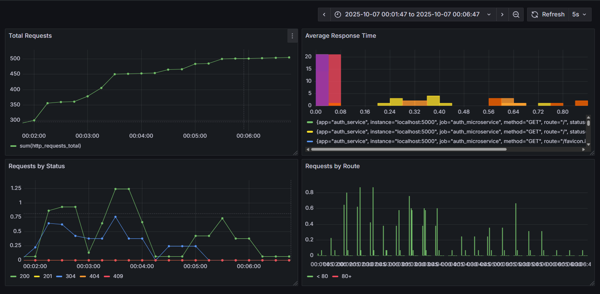
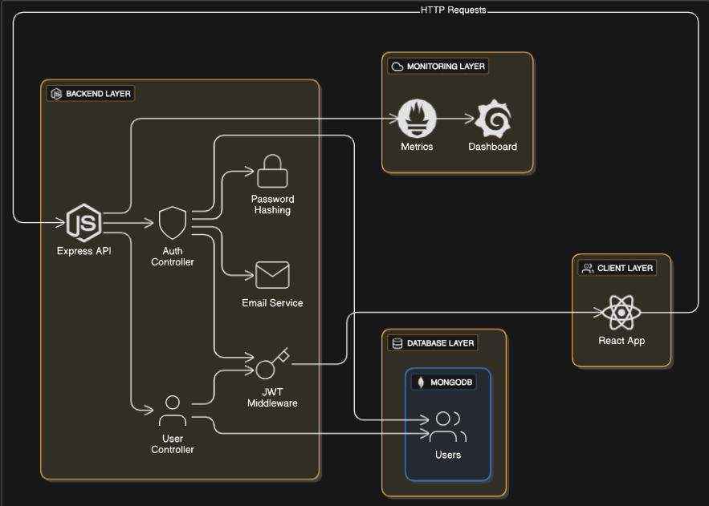

# MERN Authentication Microservice

<div align="center">

<table>
	<tr>
		<td></td>
		<td>
			<h1>AuthWatch</h1>
			<em>Secure. Scalable. Observable.</em>
		</td>
	</tr>
</table>

**A robust authentication microservice for modern web applications, featuring JWT, email verification, password reset, and monitoring.**

[](https://nodejs.org/)
[](https://expressjs.com/)
[](https://mongodb.com/)
[](https://jwt.io/)
[](https://www.docker.com/)
[](https://prometheus.io/)
[](https://grafana.com/)
[](https://jestjs.io/)
[](https://github.com/visionmedia/supertest)

[Features](#-features) • [Tech Stack](#-tech-stack) • [Getting Started](#-getting-started) • [Architecture](#-architecture) • [Contributing](#-contributing)

</div>

---

## 📋 Overview

**MERN Auth Microservice** is a production-ready authentication backend for web and mobile apps. It provides secure user registration, login, JWT-based sessions, email verification, password reset, and exposes metrics for monitoring. Built with Node.js, Express, and MongoDB, it includes comprehensive test coverage with Jest and Supertest, and is containerized for easy deployment.

---

## 📸 Screenshots

<table width="100%">
	<tr>
		<td align="center" colspan="3">
			<br/>
			<b>API Documentation</b><br/>
			<sub>Interactive Swagger UI for all endpoints</sub>
		</td>
	</tr>
	<tr>
  <td align="center" width="50%">
    <br/>
    <b>Prometheus & Grafana Dashboards</b><br/>
    <sub>Real-time monitoring endpoint</sub>
  </td>
  <td align="center" width="50%">
    <br/>
    <b>Authentication Flow</b><br/>
    <sub>JWT, Email Verification, Password Reset, Monitoring</sub>
  </td>
</tr>
</table>

---

## 🌟 Features

### Authentication
- **JWT-based Login** — Secure, stateless sessions
- **User Registration** — With hashed passwords
- **Email Verification** — OTP-based, with expiry
- **Password Reset** — Multi-step, OTP-protected
- **Logout** — Secure session termination

### Security
- **HTTP-only Cookies** — Prevent XSS attacks
- **Bcrypt Password Hashing** — 10 salt rounds
- **Environment-based Cookie Security** — SameSite, Secure flags
- **Input Validation** — Required fields, email normalization

### Monitoring & Observability
- **Prometheus Metrics** — System and custom HTTP request metrics
- **Grafana Ready** — For dashboard visualization

### Testing
- **Jest Test Suite** — Comprehensive unit and integration tests
- **Supertest** — HTTP API endpoint testing
- **MongoDB Memory Server** — In-memory database for testing
- **Test Coverage** — Authentication flows and endpoints

### Developer Experience
- **Dockerized** — Easy deployment anywhere
- **Modular Codebase** — Clean separation of concerns

---

## 🎯 Use Cases

- **User Authentication Service** for any web/mobile app
- **Microservice in a larger architecture**
- **API Gateway Auth Layer**
- **Production-ready Auth for SaaS**
- **Learning/Reference for secure Node.js auth**

---

## 🛠 Tech Stack

### Backend
| Technology      | Purpose                                 |
|-----------------|-----------------------------------------|
| Express.js      | Backend Framework                       |
| MongoDB         | NoSQL database                          |
| Mongoose        | MongoDB ODM                             |
| JWT             | Token-based authentication              |
| bcryptjs        | Password hashing                        |
| Nodemailer      | Email sending (SMTP)                    |
| prom-client     | Prometheus metrics                      |

### Testing
| Technology      | Purpose                                 |
|-----------------|-----------------------------------------|
| Jest            | Testing framework                       |
| Supertest       | HTTP assertion library                  |
| MongoDB Memory Server | In-memory MongoDB for testing     |

### DevOps
| Technology      | Purpose                                 |
|-----------------|-----------------------------------------|
| Docker          | Containerization                        |
| Prometheus      | Monitoring                              |
| Grafana         | Metrics visualization                   |

---

## 🏗 Architecture

```
┌──────────────────────────────────────────────┐
│                Client (Frontend)             │
│      (Any web/mobile app, Postman, etc.)     │
└──────────────────────────────────────────────┘
								│      HTTPS/REST
								▼
┌──────────────────────────────────────────────┐
│        MERN Auth Microservice (Node.js)      │
│ ┌──────────────┐  ┌──────────────┐           │
│ │  Express.js  │  │  Prometheus  │           │
│ │  API Server  │  │  Metrics     │           │
│ └──────────────┘  └──────────────┘           │
│        │                │                    │
│        ▼                ▼                    │
│   MongoDB Atlas   /metrics endpoint          │
└──────────────────────────────────────────────┘
```

---

## 🚀 Getting Started

### Prerequisites

- **Node.js** (v18 or higher)
- **npm**
- **MongoDB** (local or Atlas)

### Installation

1. **Clone the repository**
	 ```bash
	 git clone https://github.com/karanhimadri/mern-authentication-microservice.git
	 cd mern-authentication-microservice/server
	 ```

2. **Install dependencies**
	 ```bash
	 npm install
	 ```

3. **Configure environment variables**
	 - Copy `.env.example` to `.env` and fill in your values:
		 ```env
		 MONGO_URI=your_mongodb_connection_string
		 JWT_SECRET=your_jwt_secret
		 SMTP_USER=your_smtp_user
		 SMTP_PASS=your_smtp_pass
		 SENDER_EMAIL=your_email@example.com
		 NODE_ENV=development
		 PORT=4000
		 ```

### Running the Application

```bash
npm start
# Server runs on http://localhost:4000
```

### Testing

Run the test suite to ensure everything is working correctly:

```bash
npm test
# Runs all tests with Jest
```

The test suite includes:
- **Unit Tests**: Authentication controller functions
- **Integration Tests**: API endpoint testing with Supertest
- **Mocked Services**: Email service, JWT, and database operations

Test files are located in the `/test` directory:
- `auth.test.js` - Authentication endpoint tests
- `app.test.js` - Application setup tests

### Docker

```bash
docker build -t mern-auth-microservice .
docker run -p 8080:4000 --env-file .env mern-auth-microservice
# App will be available at http://localhost:8080
```

---

## 👨‍💻 Developer Profile

**Himadri Karan**  
*Backend Developer & Business Solutions Specialist*

- 📧 **Email**: [Karanhimadri1234@gmail.com](mailto:Karanhimadri1234@gmail.com)
- 💼 **LinkedIn**: [linkedin.com/in/himadrikaran](https://linkedin.com/in/himadrikaran)
- 🌐 **Portfolio**: [Himadri.me](https://himadri.me/)
- 🐙 **GitHub**: [github.com/karanhimadri](https://github.com/karanhimadri)

---

<div align="center">

**Made with ❤️ and lots of ☕**

If you found this project helpful, please give it a ⭐️!

</div>
